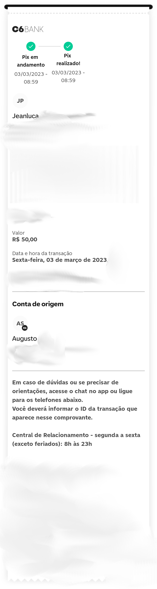

# Poc OCR imagem de uma transação de pix

## Instale as dependencias

```bash
sudo apt-get install tesseract-ocr
sudo apt-get install tesseract-ocr-por
npm i
```

## Run

```bash
npm start
```

## Imagem utilizada




## Resultado

```text
Result: CT,

C6BANK
Pix em Pix
andamento realizado!
03/03/2023 - 03/03/2023 -
08:59 08:59
JP
Jeanluca
Valor
R$ 50,00

Data e hora da transação
Sexta-feira, 03 de março de 2023,

Conta de origem

&

Augusto

Em caso de dúvidas ou se precisar de
orientações, acesse o chat no app ou ligue
para os telefones abaixo.

Você deverá informar o ID da transação que
aparece nesse comprovante.

Central de Relacionamento - segunda a sexta
(exceto feriados): 8h às 23h
```
